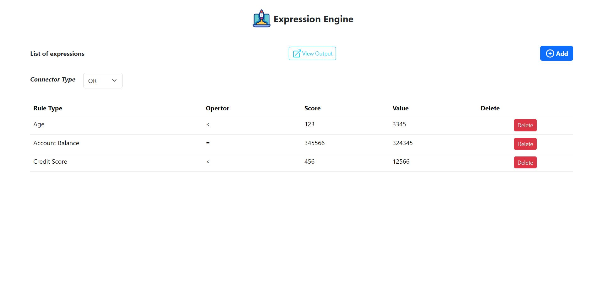
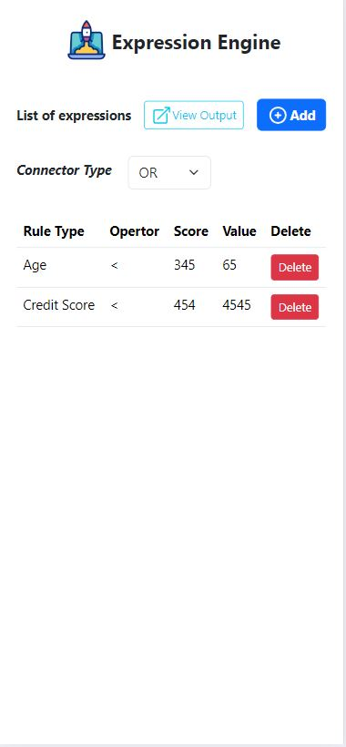

## Live Link:
https://expressionengin.onrender.com/

## Intro
The app was created as assignment for Crego.

## Expression Engine
This project is a web-based Expression Engine UI developed using React and Bootstrap. The main objective is to provide a user-friendly interface for managing expressions with different rule types, operators, values, and scores.

## Technologies Used
*   React
*   Bootstrap
*   HTML
*   CSS
## Features
1. Form Input:
Users can input connector types (AND/OR) and add expressions with the following fields:

    * Rule Type (Dropdown): Age, Credit Score, 
    * Account Balance
    * Operator: >, <, ≥, ≤, =
    * Value
    * Score

2. Adding and Deleting Expressions
Users can dynamically add expressions and delete them as needed.

3. Output Format
The application generates and displays the expressions in the expected JSON format:
    ```bash
    {
        "rules": [
            {
                "key": "age",
                "output": {
                    "value": 60,
                    "operator": ">=",
                    "score": 50
                }
            },
            {
                "key": "age",
                "output": {
                    "value": 40,
                    "operator": ">=",
                    "score": 100
                }
            },
            {
                "key": "account_balance",
                "output": {
                    "value": 100000,
                    "operator": ">=",
                    "score": 200
                }
            }
        ],
        "combinator": "and"
    }


## Getting Started
To run this project locally, follow these steps:

1. Clone the repository to your local machine:
    ```bash
    git clone https://github.com/yash1997verma/WeatherApp.git

2. Change into the project directory:
    ```bash
    cd expression-engine-ui

3. Install dependencies:
    ```bash
    npm install

4. Run the application
    ```bash
    npm start


**Screenshots**

-*Full Screen* 


     

-*Mobile*

